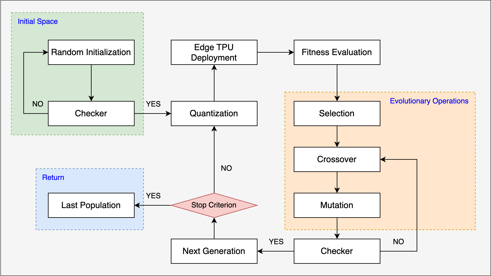

# Genetic Neural Architecture Search (Genetic_NAS)
<!-- [](https://github.com/sypsyp97/Genetic_NAS/commits/main) -->
<!-- [](https://docs.python.org/3.9/) -->
[](https://opensource.org/licenses/Apache-2.0)
[](https://github.com/sypsyp97/Genetic_NAS/issues)
[](https://sypsyp97.github.io/Genetic_NAS/)
[](https://github.com/psf/black)


Welcome to the Genetic_NAS repository, a crucial part of [Yipeng Sun](https://github.com/sypsyp97)'s Master's Thesis project. This project explores the use of genetic algorithms to search for adaptable models specifically designed for Edge TPU. 

If you find our work and our open-sourced efforts useful, ⭐️ to encourage our following development! :)

---

## Contents

- [Overview](#overview)
- [Environment and Installation](#environment-and-installation)
- [Repository Structure](#repository-structure)
- [Usage Example](#usage-example)
- [Documentation](#documentation)
- [License](#license)
- [Citation](#citation)
- [Contact](#contact)

---

## Overview

The expanding use of edge devices and the constraints on cloud connectivity call for efficient, on-device neural networks for real-time applications. Manually designing these networks is complex due to the need for a balance between accuracy, speed, and efficiency, particularly for edge devices with computational and power limitations. Neural Architecture Search (NAS) has been introduced to automate the design process, often producing models that surpass human-designed ones. Genetic Algorithms, which traverse vast search spaces to find optimal solutions using mechanisms akin to natural selection, have shown potential in NAS. 

The goal of this repository is to harness the power of Genetic Algorithm-based NAS to create edge-optimized models specifically designed for Edge TPUs. This aims to enable real-time, accurate image classification tasks while minimizing power consumption and computational resource usage.

#### Genetic_NAS Workflow


---
## Environment and Installation

This project is developed in [Python 3.9](https://www.python.org/downloads/release/python-390/) environment with [TensorFlow 2.11](https://www.tensorflow.org/install/pip) being the major library used. To set up the environment, follow these steps:

- Clone the repository to your local machine：
 ```bash
git clone https://github.com/sypsyp97/Genetic_NAS.git
cd Genetic_NAS
```

- Set up a [Miniconda](https://docs.conda.io/en/latest/miniconda.html) environment and install the required packages:
```bash
conda create -n Genetic_NAS python=3.9
conda activate Genetic_NAS
pip install -r requirements.txt

```
---
## Repository Structure

The repository is structured as follows:
```
├── src
|  └── Compile_Edge_TPU.py
|  └── Create_Model.py
|  └── Decode_Block.py
|  └── Evaluate_Model.py
|  └── Evolutionary_Algorithm.py
|  └── Fitness_Function.py
|  └── Gene_Pool.py
|  └── Model_Checker.py
|  └── Search_Space.py
|  └── TFLITE_Converter.py
|
├── assets
|  └── workflow.png
|
├── get_datasets
|  └── Data_for_TFLITE.py
|
├── tf_flower_example.py
└── README.md
```

- `src/`: This directory contains the main source code for the project and utility scripts that aid in various tasks throughout the project.
- `get_datasets/`: This directory includes scripts for data acquisition.
- `tf_flower_example.py`: A Python script that is used for testing the application with the TensorFlow Flowers dataset.


---

## Usage Example

Before running the NAS process, please ensure that you have an Edge TPU device available. You will also need to install the necessary libraries and dependencies for working with the Edge TPU. Instructions for setting up the Edge TPU can be found in [Coral Documentation](https://coral.ai/docs/accelerator/get-started/).

Here's an example of how you can use the `start_evolution` function to initiate the process of NAS:

```python
from src.Evolutionary_Algorithm import start_evolution

population_array, max_fitness_history, average_fitness_history, best_models_arrays = start_evolution(
        train_ds=train_dataset,
        val_ds=val_dataset,
        test_ds=test_dataset,
        generations=4,
        population=20,
        num_classes=5,
        epochs=30,
        time=formatted_date
    )
```

You can also easily start the NAS process by running the `tf_flower_example.py` script. This script has been designed to make running the NAS process simpler by predefining certain parameters and steps.
```bash
python tf_flower_example.py
```
---
## Documentation

The detailed documentation for the functions used in this project is available [online](https://sypsyp97.github.io/Genetic_NAS/).

Alternatively, you can clone the `gh-pages` branch of this repository to view the documentation offline:

- Clone the `gh-pages` branch to your local machine：
 ```bash
git clone -b gh-pages https://github.com/sypsyp97/Genetic_NAS.git ./Genetic_NAS_Doc
cd Genetic_NAS_Doc
 ```
- Open the `index.html` file in a web browser to view the documentation.
```bash
xdg-open index.html
```
---
## License

This project is licensed under [Apache-2.0 License](LICENSE). 

---
## Citation

If this work is helpful, please cite as:

```bibtex
@Misc{Genetic_NAS,
  title = {Genetic Neural Architecture Search for Edge TPU},
  author = {Yipeng Sun, Andreas M. Kist},
  howpublished = {\url{https://github.com/sypsyp97/Genetic_NAS.git}},
  year = {2023}
}
```
---

## Contact

For further assistance or any questions, feel free to open an issue on this GitHub repository or reach out to the maintainer.

**Yipeng Sun**
- Github: [@sypsyp97](https://github.com/sypsyp97)
- Email: [yipeng.sun@fau.de](mailto:yipeng.sun@fau.de)

Please adhere to the code of conduct when interacting with the community and keep discussions relevant to the project. Happy coding!
